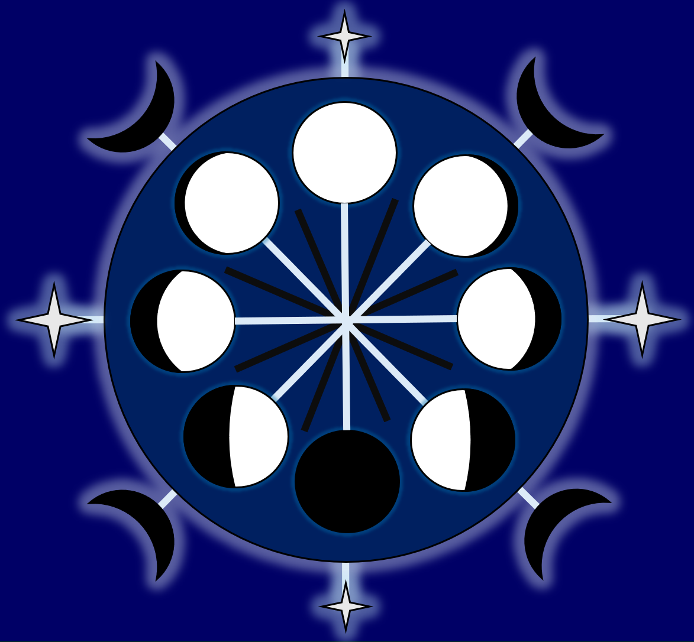

# GENCG HS25 Journal by Kayleigh Waser

# Week 01
Today, we got to start this new course with lots of inputs and a fun exercise in pairs: the Sprouts Game.

  
  
<i>Our first exercise: The Sprouts Game from Lecture 01.</i>

Currently, I am still struggling with the set up in github. But, I am curious, where this journey will lead us to.

# Week 02
For our first exercise of the day, we had a look at grids. With the inspiration provided in the lecture I started with a basic draft. Since I do not have a coding background, I had some help from ChatGPT, Google Gemini AI and p5.js References (https://p5js.org/reference/) to translate my ideas into code. This exercise gave me some basic understand of how to set up the canvas, to include shapes, colors and arrange placements and layers. The final sketch ended up with the code like this:

// Variables for animation
let angle = 0;
let pulseSize = 1;
let pulseDirection = 0.01;

function setup() {
  createCanvas(400, 400);
  // Set rectangle mode to center for easier positioning
  rectMode(CENTER);
}

function draw() {
  background(0);
  
  // Create a grid using loops (more efficient than drawing each line individually)
  drawGrid();
  
  // Animate the shapes
  animateShapes();
}

function drawGrid() {
  // Set grid properties
  stroke('purple');
  strokeWeight(1);
  
  // Draw horizontal lines
  for (let y = 0; y <= height; y += 50) {
    line(0, y, width, y);
  }
  
  // Draw vertical lines
  for (let x = 0; x <= width; x += 50) {
    line(x, 0, x, height);
  }
}

function animateShapes() {
  // Update animation variables
  angle += 0.02;
  pulseSize += pulseDirection;
  
  // Reverse pulse direction when it gets too big or too small
  if (pulseSize > 1.5 || pulseSize < 0.5) {
    pulseDirection *= -1;
  }
  
  // Animated blue circle - rotates and pulses
  push(); // Save current drawing state
  translate(100, 100); // Move origin to circle center
  rotate(angle); // Rotate around the center
  fill('blue');
  circle(0, 0, 100 * pulseSize); // Draw circle at new origin
  pop(); // Restore original drawing state
  
  // Animated red ellipse - moves in a circular path
  let ellipseX = 300 + cos(angle * 1.5) * 50;
  let ellipseY = 300 + sin(angle * 1.5) * 50;
  fill('red');
  ellipse(ellipseX, ellipseY, 100, 50);
  
  // Animated triangle - bounces vertically
  let triangleY = 75 + sin(angle * 2) * 25;
  fill('white');
  triangle(300, triangleY, 258, triangleY - 55, 286, triangleY + 25);
  
  // Animated square - changes color and size
  let squareSize = 50 + sin(angle) * 20;
  let squareColor = color(
    150 + sin(angle) * 105,
    100 + cos(angle) * 100,
    200 + sin(angle * 0.7) * 55
  );
  fill(squareColor);
  rect(200, 200, squareSize, squareSize);
}

Put into p5.js, the code turned into that:


<iframe src="https://editor.p5js.org/KayWa7/full/_pKU21a6k" width="100%" height="450" frameborder="no"></iframe>


# Week 03 
To combine the grid and time exercises of this and last week, I tried programming a rough and simple moon phase cycle in the p5-editor. For now, I restrict myself to simple shapes until I have more practise with the new tools. I made a rough sketch in PowerPoint to plan the composition.

  
  
<i>My initial sketch idea: The Lunar Cycle.</i>

The code used to create a basis in p5.js looked as follows:

let angle = 0;     // for moon orbit
let lineLength = 50;  // base line length
let t = 0;         // time variable for easing

function setup() {
  createCanvas(500, 500);
  angleMode(DEGREES);
}

function draw() {
  background(87);

  translate(width/2, height/2);

  // Ease the line length (sin wave)
  let easedLength = lineLength + sin(t) * 30;
  t += 2; // speed of easing

  stroke(0);
  strokeWeight(4);

  // Draw radiating lines
  for (let i = 0; i < 6; i++) {
    let x = cos(i * 60) * easedLength;
    let y = sin(i * 60) * easedLength;
    line(0, 0, x, y);
  }

  // Orbiting moons
  let orbitRadius = 150;
  let moonSize = 60;

  for (let i = 0; i < 4; i++) {
    let x = cos(angle + i * 90) * orbitRadius;
    let y = sin(angle + i * 90) * orbitRadius;

    // draw moon base
    noStroke();
    fill(0);
    ellipse(x, y, moonSize);

    // add moon phase mask
    fill(255);
    if (i === 0) {
      // full moon
      ellipse(x, y, moonSize);
    } else if (i === 1) {
      // waning (left shadow)
      ellipse(x + 15, y, moonSize);
    } else if (i === 2) {
      // new moon (fully black, do nothing extra)
    } else if (i === 3) {
      // waxing (right shadow)
      ellipse(x - 15, y, moonSize);
    }
  }

  // make moons orbit
  angle += 1;
}


<iframe src="https://editor.p5js.org/KayWa7/full/RjQTIRIfo" width="100%" height="450" frameborder="no"></iframe>


This experiment gave me some programming ideas while I try to find my project by experimenting more with designs and patterns.
What I would like to do is to have a dial animation, meaning the moons move in a circle while the lines ease in and out. Those elements are included in the sketch, yet it lacks colors and is not nice to look at with the odd full moons which out to be crescent shapes.

# Week 04 
This week, we yet again look at "time" as a topic. The first artworks that come to my mind are - of course - by Salvador Dalí with his melting clocks...:

  
  
<i>Salvador Dalí - The Persistence of Memory (Melting Clocks).</i>

https://www.framedcanvasart.com/wp-content/uploads/2024/12/The-Persistence-of-Memory-Melting-Clocks-Painting-Salvador-Dali.jpg 

... and a video installation I have spotted right next to the Paddington Station in London. It shows a man painting, erasing and repainting the minute hand on a regular train station's clock. A quick online search told me, that said installation is by Maarten Baas and part of the series "Real Time Clock".

  
  
<i>a close-up photo I took during my last trip to London.</i>

  
  
<i>another photo I took during my last visit to Paddington Station.</i>



  <iframe 
    width="100%" 
    height="450" 
    src="https://www.youtube.com/embed/TigeOpy5-TA" 
    title="YouTube video player" 
    frameborder="0" 
    allow="accelerometer; autoplay; clipboard-write; encrypted-media; gyroscope; picture-in-picture; web-share" 
    allowfullscreen>
  </iframe>
  
<i>Marten Baas - Real Time Clock (Paddington Station installation)</i>


https://www.youtube.com/watch?v=TigeOpy5-TA 

I, then went online again to research art pieces about time and its passage. During this brief search, I discovered an installation by Maya Lin, titled "Eclipsed Time". Exhibited in New York, a disk installed in the ceiling causes an eclipse in intervals, demonstrating the passage of time.

  
  
<i>Maya Lin - Eclipsed Time.</i>

https://uploads5.wikiart.org/00109/images/maya-lin/eclipsed-time-1989-95.jpg 

For my project, I would like to incorporate lunar cycles as a representation of time, ideally combine it with some sort of pendulum, like an old grandfather clock.

  
  
<i>a pendulum: drawing machine and artwork created over time.</i>

(https://www.etsy.com/de/listing/638336792/pendel-auf-sand-meditatives-pendel)

  
  
<i>a piece of spirograph artwork I found during my research.</i>

(https://www.linkedin.com/pulse/design-magic-spirograph-ron-gagnier)

Another object to draw inspiration from would be sun dials, from those one may find in a garden to the ancient ones created by indigenous tribes such as the Aztecs. Actually, my grandfather had brought a heavy one made of a turquoise type of stone from his travels to Mexico. It always held a fascination for me. Unfortunately, it perished when his apartment was cleaned out.

  
  
<i>The Aztec Sun Stone displayed at the National Anthropology Museum in Mexico City.</i>

https://www.reddit.com/media?url=https%3A%2F%2Fpreview.redd.it%2Fd9t0yjd55hg61.jpg%3Fwidth%3D640%26crop%3Dsmart%26auto%3Dwebp%26s%3Df860bf3b48f0d15dc8cce429ae663d03cbc92846

On the side of generative art, I found some stunning pieces. Like:



  <iframe 
    width="100%" 
    height="450" 
    src="https://www.youtube.com/embed/TgbKxXBOUC8" 
    title="Flowers and People - Dark by teamLab" 
    frameborder="0" 
    allow="accelerometer; autoplay; clipboard-write; encrypted-media; gyroscope; picture-in-picture; web-share" 
    allowfullscreen>
  </iframe>
  
<i>teamLab - Flowers and People - Dark βVer.</i>


(https://www.youtube.com/watch?v=TgbKxXBOUC8&list=TLGGjIvR6gz3QvkyODEyMjAyNQ&t=4s)

"Flowers and People - Dark βVersion" by teamLab displays a constant cycle of birth and decay: an algorithm generates flowers in realtime, it is not a pre-recorded video. It is an interactive installation, which reacts to the proximity and movement of spectators. If someone stands still, the flowers bloom and grow. But, as soon as they move, the flowers start to wither. This piece combines a representation of time with direct interaction.



  <iframe 
    width="100%" 
    height="450" 
    src="https://www.youtube.com/embed/FgPpmaImuEs" 
    title="Making time for Christian Marclay's 'The Clock'" 
    frameborder="0" 
    allow="accelerometer; autoplay; clipboard-write; encrypted-media; gyroscope; picture-in-picture; web-share" 
    allowfullscreen>
  </iframe>
  
<i>Christian Marclay - The Clock (CBS Sunday Morning Report)</i>


(https://www.youtube.com/watch?v=FgPpmaImuEs)

"The Clock" by Christian Marclay is a traveling video experience. It is a 24-hour supercut of various clips and excerpts of films, each dealing or displaying "time" and edited to match activites fitting to the time shown. The time shown in the various clip is synced to the local timezone. Should you enter the experience at 06:30 AM local time for example, you'll see Meryl Streep's character Miranda Priestly from "The Devil Wears Prada" switch off her alarm clock, which is set for 06:30 AM.



  <iframe 
    width="100%" 
    height="450" 
    src="https://www.youtube.com/embed/jwOBEZOfWdE" 
    title="Mandelbox World by San Base" 
    frameborder="0" 
    allow="accelerometer; autoplay; clipboard-write; encrypted-media; gyroscope; picture-in-picture; web-share" 
    allowfullscreen>
  </iframe>
  
<i>San Base - Mandelbox World (Fractal Generative Art)</i>


(https://www.youtube.com/watch?v=jwOBEZOfWdE)

The last example I wish to point out is this piece by San Base. This artist works with contiously evolving algorithms, making their works ever changing. Be it a landscape such as "Fractal Trees" or something more abstract like the mechanical-looking "Mandelbox World". Each artwork is generated over time and spectators never see the same piece twice (except one watches a recording).

I also encountered so-called "Peril-Noise Fields", some works of which reminding me of bits of cloth in liquid. While I found the mentioned examples astonishing, especially the various pieces by San Base, they seemed too advanced and too far away from my core idea to attempt to try. Also, it would probably end up in a replica of this existing artwork rather than my own interpretation.

# Week 05 
In today's lecture, we had a look at automated drawing machines. My immediate train of thought went to paint can artwork, in which a container filled with paint is hung on a rope and released onto a canvas. The released paint creates a seemingly infinte path as the container swings like a pendulum or a spirograph. 

  
  
<i>a spirograph painting I found on Reddit while researching.</i>

(https://lh3.googleusercontent.com/Mv6LgdJedWVizMWZUveLO1pEjBydQ9Njk5KiQf8FivjlnNoDJgQfJC5fdn5GgjC70Tyjk-LxamS3lMCJZYoMBckQssOtukIQDVs8xpLXzSWwC37grEhPQJAMsY5Dj-H9kIMuvgnCHPc0nXu2yfY8Sg_NVpNnbF3KVxqVH6M6PUjrdaG0TgoOycYAew) 

  
  
<i>a spirograph painting I found on Etsy while researching.</i>

(https://i.etsystatic.com/24858016/r/il/86d371/2602609981/il_1588xN.2602609981_r9wp.jpg) 

I took this idea into p5.js and programmed a pendulum/drawing machine there, which creates a flower-like pattern in tones of blue and purple.


<iframe src="https://editor.p5js.org/KayWa7/full/knUcwVDIa" width="800" height="800" frameborder="no"></iframe>


The code I used looks as follows: 
let t = 0;                 // time variable for pendulum motion
let rotation = 0;          // overall rotation angle of the figure-eight
let hueShift = 200;        // color hue (blue start)
let cycleCount = 0;
let lastSign = 1;
let centerX, centerY;

function setup() {
  createCanvas(800, 800);
  colorMode(HSB, 360, 100, 100);
  background(0);
  noFill();
  strokeWeight(2);
  centerX = width / 2;
  centerY = height / 2;
}

function draw() {
  // Parameters
  let swingSpeed = TWO_PI / 2;   // 2 seconds per full figure-8 loop
  let rotateSpeed = radians(0.7); // slow rotation per frame
  let xAmp = 250;
  let yAmp = 150;

  // Calculate figure-eight path
  let x = sin(t) * xAmp;
  let y = sin(t * 2) * yAmp / 2;

  // Apply slow rotation to entire pendulum system
  let rx = x * cos(rotation) - y * sin(rotation);
  let ry = x * sin(rotation) + y * cos(rotation);
  let drawX = centerX + rx;
  let drawY = centerY + ry;

  // Draw trail line (connect previous and current positions)
  stroke(hueShift, 100, 100, 0.8);
  point(drawX, drawY);

  // Color change per full loop
  let sign = sin(t) > 0 ? 1 : -1;
  if (sign !== lastSign) {
    cycleCount++;
    if (cycleCount % 2 === 0) {
      hueShift += 10;
      if (hueShift > 300) hueShift = 200; // cycle blue→purple
    }
    lastSign = sign;
  }

  // Advance motion and rotation
  t += swingSpeed / 60;
  rotation += rotateSpeed;
}

This mandala shape is created one second at a time, with the swings of the pendulum timed to last one second each.
After the difficulties I have faced in Visual Studio Code while trying to add images and files to this journal, I am glad to have found a way to combine some of themes and tasks of the past weeks.

I wished to fill the canvas some more and tried to find a simple way to add more depth to the design, so I added a second pendulum behind the first. The second pendulum is larger and changes color randomly every second, making that change with every swing. Here is a snippet of the new bits of code:

// Calculation for the second (larger) pendulum
let t2 = t; 
let rotation2 = rotation * 0.8;

let x2 = sin(t2) * xAmp2;
let y2 = sin(t2 * 2) * yAmp2 / 2;

let rx2 = x2 * cos(rotation2) - y2 * sin(rotation2);
let ry2 = x2 * sin(rotation2) + y2 * cos(rotation2);
let drawX2 = centerX + rx2;
let drawY2 = centerY + ry2;

// Random color change every 1000ms
if (millis() - lastColorChange > 1000) {
  hue2 = random(360);
  lastColorChange = millis();
}

strokeWeight(4); // Thicker trail
stroke(hue2, 100, 100, 0.4); // More transparent
point(drawX2, drawY2);


<iframe src="https://editor.p5js.org/KayWa7/full/M7HkOkjYh" width="100%" height="450" frameborder="no"></iframe>


A next step could be to add controls for users to change the velocity in which the pendulum circles.

# Week 06 
In today's lecture, we formed groups to exchange our ideas and journals. I still could not upload any media properly at that time, so I continue to work with links. It felt inspiring and motivating to see what some of my classmates have been up to during the past weeks. I received tips on the set up for github.
As for my research and state of the project, I received positive feedback. My latest "sketch" has been called "hypnotic" and "relaxing". I am aware that I need to invest some time in my Javascript coding skills to make my ideas a reality. Even though, not everything works the way it should, I feel like I reached a point where I need to put all my energy and effort into the project rather than making github work.

# Week 07 
With today's topic of faces, I commited myself to programming instead of designing something. I simply aimed for replicating this inspirational image:

  
  
<i>an inspiration for a wireframe face.</i>

https://www.dreamstime.com/vector-art-wireframe-depiction-human-face-representing-d-modeling-facial-recognition-technology-digital-identity-image405942177

My first attempt with the help of AI created a grid but not a face. What I liked about it was that the grid moves along with the mouse. That way, should I be able to model a face through code, spectators could get a good look from all angles.


<iframe src="https://editor.p5js.org/KayWa7/full/_IRNlUl9n" width="100%" height="450" frameborder="no"></iframe>


let cols = 30; // Number of columns in the grid
let rows = 30; // Number of rows in the grid
let points = []; // Array to store all grid points

let angleX = 0; // For subtle auto-rotation if desired
let angleY = 0;

let noiseStrength = 0.005; // How much the noise influences point positions
let noiseScale = 0.05;    // How "zoomed in" the noise is

function setup() {
  createCanvas(800, 600, WEBGL); // Use WEBGL for 3D rendering
  
  // No need for explicit noiseSeed here, as Perlin noise will generate variation over time.
  // If you want a fixed starting configuration, you could set one.
  
  // Generate a base grid of points, resembling a curved surface
  // We'll arrange points in rows and columns
  for (let i = 0; i < rows; i++) {
    let row = [];
    for (let j = 0; j < cols; j++) {
      // Calculate initial position based on a spherical or elliptical shape
      // This creates a base "face" like curvature
      let x = map(j, 0, cols - 1, -200, 200);
      let y = map(i, 0, rows - 1, -250, 250); // Make it slightly taller
      
      // A simple elliptical/spherical function to give it depth
      // Adjust these values to get a more face-like initial curve
      let z = sin(map(j, 0, cols - 1, 0, PI)) * cos(map(i, 0, rows - 1, -PI/2, PI/2)) * 150;
      
      // Adjust Z for a more prominent "forehead" and "chin"
      if (i < rows * 0.2) z *= 1.2; // Push forehead out a bit
      if (i > rows * 0.8) z *= 0.8; // Pull chin back a bit

      row.push(createVector(x, y, z));
    }
    points.push(row);
  }
}

function draw() {
  background(20); // Dark background
  
  // Optional: Subtle automatic rotation for better 3D perception
  // rotateX(angleX);
  // rotateY(angleY);
  // angleX += 0.0005;
  // angleY += 0.0007;

  // Manual mouse control for rotation
  rotateY(map(mouseX, 0, width, -PI, PI));
  rotateX(map(mouseY, 0, height, PI/2, -PI/2));

  stroke(0, 200, 255, 180); // Cyan/blueish glow for lines
  strokeWeight(1);
  noFill();

  // Offset for noise function to make it "shift" over time
  let timeOffset = frameCount * noiseStrength;

  // Iterate through the grid to deform points and draw connections
  for (let i = 0; i < rows; i++) {
    beginShape(POINTS); // We will draw individual points later
    for (let j = 0; j < cols; j++) {
      let p = points[i][j];

      // Use Perlin noise to deform the base coordinates
      // The noise "moves" each point independently but smoothly
      let noiseValX = noise(p.x * noiseScale + timeOffset, p.y * noiseScale);
      let noiseValY = noise(p.x * noiseScale, p.y * noiseScale + timeOffset);
      let noiseValZ = noise(p.x * noiseScale + timeOffset * 0.5, p.y * noiseScale + timeOffset * 0.5, timeOffset * 0.5);

      // Map noise values to a deformation range
      let deformX = map(noiseValX, 0, 1, -20, 20);
      let deformY = map(noiseValY, 0, 1, -20, 20);
      let deformZ = map(noiseValZ, 0, 1, -30, 30); // Z deformation has more impact

      // Apply deformation to the base point
      let deformedX = p.x + deformX;
      let deformedY = p.y + deformY;
      let deformedZ = p.z + deformZ;

      // Draw connections for the grid
      if (j < cols - 1) { // Connect horizontally
        let nextP = points[i][j+1];
        let nextNoiseValX = noise(nextP.x * noiseScale + timeOffset, nextP.y * noiseScale);
        let nextNoiseValY = noise(nextP.x * noiseScale, nextP.y * noiseScale + timeOffset);
        let nextNoiseValZ = noise(nextP.x * noiseScale + timeOffset * 0.5, nextP.y * noiseScale + timeOffset * 0.5, timeOffset * 0.5);
        
        let nextDeformedX = nextP.x + map(nextNoiseValX, 0, 1, -20, 20);
        let nextDeformedY = nextP.y + map(nextNoiseValY, 0, 1, -20, 20);
        let nextDeformedZ = nextP.z + map(nextNoiseValZ, 0, 1, -30, 30);
        
        line(deformedX, deformedY, deformedZ, nextDeformedX, nextDeformedY, nextDeformedZ);
      }
      if (i < rows - 1) { // Connect vertically
        let downP = points[i+1][j];
        let downNoiseValX = noise(downP.x * noiseScale + timeOffset, downP.y * noiseScale);
        let downNoiseValY = noise(downP.x * noiseScale, downP.y * noiseScale + timeOffset);
        let downNoiseValZ = noise(downP.x * noiseScale + timeOffset * 0.5, downP.y * noiseScale + timeOffset * 0.5, timeOffset * 0.5);

        let downDeformedX = downP.x + map(downNoiseValX, 0, 1, -20, 20);
        let downDeformedY = downP.y + map(downNoiseValY, 0, 1, -20, 20);
        let downDeformedZ = downP.z + map(downNoiseValZ, 0, 1, -30, 30);

        line(deformedX, deformedY, deformedZ, downDeformedX, downDeformedY, downDeformedZ);
      }
      
      // Draw the DOT at the deformed position (optional, could be removed for pure lines)
      // To draw dots, we need to end the current shape and start a new one for POINTS
      push();
      stroke(0, 255, 255); // Brighter dots
      strokeWeight(2); // Thicker dots
      point(deformedX, deformedY, deformedZ);
      pop();
    }
  }
}

// Function to reset the base mesh or noise if needed
function mousePressed() {
  // Can add a feature here to generate a completely new "base" shape if desired
  // For now, the noise will continuously shift it.
}

Next, I tried to have an actual face, but the way it turned out reminded me more of Pinocchio rather than a real human face. I definitely need to make changes to come near the image I looked up.


<iframe src="https://editor.p5js.org/KayWa7/full/loZMh5ZER" width="100%" height="450" frameborder="no"></iframe>


let cols = 30; // Number of columns in the grid
let rows = 30; // Number of rows in the grid
let points = []; // Array to store all grid points

let angleX = 0; 
let angleY = 0;

let noiseStrength = 0.005; 
let noiseScale = 0.05;    

function setup() {
  createCanvas(800, 600, WEBGL); 
  
  // Base constants for facial features (normalized to grid indices)
  const noseColStart = round(cols * 0.45);
  const noseColEnd = round(cols * 0.55);
  const noseRow = round(rows * 0.45);
  const eyeRow = round(rows * 0.3);
  const eyeWidth = round(cols * 0.15);
  
  // Generate the grid points with feature geometry
  for (let i = 0; i < rows; i++) {
    let row = [];
    for (let j = 0; j < cols; j++) {
      // 1. Calculate base position (x, y)
      let x = map(j, 0, cols - 1, -200, 200);
      let y = map(i, 0, rows - 1, -250, 250); 
      
      // 2. Calculate base Z (depth) for general curvature (ellipsoid)
      let z = sin(map(j, 0, cols - 1, 0, PI)) * cos(map(i, 0, rows - 1, -PI/2, PI/2)) * 150;
      
      // --- Feature Logic ---

      // A. Create the NOSE PEAK (Push Z forward)
      if (i > noseRow && i < noseRow + 5) { // Vertical position for the nose area
        if (j >= noseColStart && j <= noseColEnd) { // Central columns
          // Map distance from center to push Z out further (peak effect)
          let nosePeakFactor = 1.0 - abs(j - cols/2) / (cols/2); 
          z += 100 * nosePeakFactor; // Push the Z coordinate significantly forward
        }
      }
      
      // B. Create the EYE SOCKETS (Pull Z backward to create gaps)
      // Check the row for eye height
      if (i >= eyeRow && i < eyeRow + 5) { 
        // Left Eye Socket (adjust j for column range)
        if (j > noseColStart - eyeWidth && j < noseColStart) {
            z -= 60; // Pull Z backward to create a concave socket
        }
        // Right Eye Socket
        if (j > noseColEnd && j < noseColEnd + eyeWidth) {
            z -= 60; // Pull Z backward
        }
      }

      row.push(createVector(x, y, z));
    }
    points.push(row);
  }
}

// ---------------------------------------------------------------- //

// The draw() function remains the same as in the previous response, 
// handling noise deformation, line connections, and 3D rendering.

function draw() {
  background(20); 
  
  rotateY(map(mouseX, 0, width, -PI, PI));
  rotateX(map(mouseY, 0, height, PI/2, -PI/2));

  stroke(0, 200, 255, 180); 
  strokeWeight(1);
  noFill();

  let timeOffset = frameCount * noiseStrength;

  for (let i = 0; i < rows; i++) {
    for (let j = 0; j < cols; j++) {
      let p = points[i][j];

      // Use Perlin noise to deform the base coordinates (Z deformation has more impact)
      let noiseValX = noise(p.x * noiseScale + timeOffset, p.y * noiseScale);
      let noiseValY = noise(p.x * noiseScale, p.y * noiseScale + timeOffset);
      let noiseValZ = noise(p.x * noiseScale + timeOffset * 0.5, p.y * noiseScale + timeOffset * 0.5, timeOffset * 0.5);

      let deformX = map(noiseValX, 0, 1, -20, 20);
      let deformY = map(noiseValY, 0, 1, -20, 20);
      let deformZ = map(noiseValZ, 0, 1, -30, 30); 

      // Apply deformation to the base point
      let deformedX = p.x + deformX;
      let deformedY = p.y + deformY;
      let deformedZ = p.z + deformZ;

      // Draw connections for the grid
      if (j < cols - 1) { // Connect horizontally
        let nextP = points[i][j+1];
        let nextDeformedZ = nextP.z + map(noise(nextP.x * noiseScale + timeOffset * 0.5, nextP.y * noiseScale + timeOffset * 0.5, timeOffset * 0.5), 0, 1, -30, 30);
        let nextDeformedY = nextP.y + map(noise(nextP.x * noiseScale, nextP.y * noiseScale + timeOffset), 0, 1, -20, 20);
        let nextDeformedX = nextP.x + map(noise(nextP.x * noiseScale + timeOffset, nextP.y * noiseScale), 0, 1, -20, 20);
        
        line(deformedX, deformedY, deformedZ, nextDeformedX, nextDeformedY, nextDeformedZ);
      }
      if (i < rows - 1) { // Connect vertically
        let downP = points[i+1][j];
        let downDeformedZ = downP.z + map(noise(downP.x * noiseScale + timeOffset * 0.5, downP.y * noiseScale + timeOffset * 0.5, timeOffset * 0.5), 0, 1, -30, 30);
        let downDeformedY = downP.y + map(noise(downP.x * noiseScale, downP.y * noiseScale + timeOffset), 0, 1, -20, 20);
        let downDeformedX = downP.x + map(noise(downP.x * noiseScale + timeOffset, downP.y * noiseScale), 0, 1, -20, 20);
        
        line(deformedX, deformedY, deformedZ, downDeformedX, downDeformedY, downDeformedZ);
      }
      
      // Draw the DOT at the deformed position
      push();
      stroke(0, 255, 255); 
      strokeWeight(2); 
      point(deformedX, deformedY, deformedZ);
      pop();
    }
  }
}

On the organisational side, I figured out how to add the P5.js files into this journal, which I am glad about and it fuels my motivation. At least now, I am able to demonstrate in a more direct way what I am experiement with and working on.

# Week 08 
This week, I took the time to sit down and figure out some coding. With the help of AI, I managed to create a base to work with and extend the final project. I tried to implement the moon phase/dial idea into working code. The result is far from satisfying with the crescent shapes not being created the way they ought to:


<iframe src="https://editor.p5js.org/KayWa7/full/qBh9-EqPG" width="100%" height="450" frameborder="no"></iframe>


It still needs detail work but this is the closest I got to my vision. I am guessing it is an issue with the black and white spaces overlapping each other. I tried changing the locations but there was no real improvement. Unfortunately, I have lost the overview of where to find what shape in order to change the layers. 
What I also would like to integrate is the meditative color pendulum somehow. The whole piece, as I currently envision it, would focus on the topic of time.

# Week 09
This week, we had another sheduled exchange session. I took the opportunity to get some clarity on the expected scale of our project. After an interesting and informative conversation, I drew new strength, motivation and inspiration to move onwards.
On the programming side of things, I tried to correct some flaws in my lunar dial sketch. I managed to get some slight improvements, though I still got a long way to go before it is how I envisioned it.


<iframe src="https://editor.p5js.org/KayWa7/full/0EtSBjY5_" width="100%" height="450" frameborder="no"></iframe>


Maybe, I will abandon the idea to some extent. I would still like to stay within the topic of "time", its representation and use the moon and stars as an inspiriation. But I would like to include some drawing machine in the concept.
An idea, which just struck me: I would still use the rotating outer ring with the cresent moons and stars. But instead of the sigil-esque symbol in the middle, I could have one moon with a black shape shifting from one side to the other to create the phases of the moon.
On the other hand, I still like the pendulum spirograph sketch I made weeks ago. Maybe the pendulum could visualize the passing of days in the lunar cycle.

# Week 10
As today's lesson was about pixel, I wanted to do a side experiment. I realized, that I never tried to have a practice sketch, where the artwork reacts to the user. So, after many failed attempts, I managed to program a simple blue background and a code which generates star patterned pixels whenever users move their cursor over the canvas.


<iframe src="https://editor.p5js.org/KayWa7/full/2UTOkT4ba" width="100%" height="450" frameborder="no"></iframe>


// --- Configuration ---
const CANVAS_WIDTH = 800; // Size of the canvas
const CANVAS_HEIGHT = 600; // Size of the canvas
const REVEAL_BLOCK_SIZE = 10; // The size of the "pixel" or block that is revealed
let BG_COLOR; // Will hold the p5.js deep blue color object

// A Set to efficiently store the coordinates of all revealed blocks
let revealedBlocks = new Set(); 

/**
 * The p5.js setup function: runs once when the sketch starts.
 */
function setup() {
    // Creates the main canvas
    createCanvas(CANVAS_WIDTH, CANVAS_HEIGHT);
    
    // Explicitly define the background color: Deep monochrome blue (RGB)
    BG_COLOR = color(10, 20, 50); 
    
    background(BG_COLOR); 
    noStroke(); // Stars will be solid white shapes
    frameRate(60);
}

/**
 * The p5.js draw function: this is kept empty because we only draw when the mouse moves.
 */
function draw() {
    // Drawing logic is in mouseMoved() for instant, cursor-driven response.
}

/**
 * A utility function to draw a 5-pointed star (pentagram).
 * @param {number} x - Center X coordinate.
 * @param {number} y - Center Y coordinate.
 * @param {number} radius - The radius of the star.
 */
function drawPentagram(x, y, radius) {
    const numPoints = 5;
    const angleStep = TWO_PI / numPoints; 
    const halfRadius = radius / 2.5; // Inner radius for the star shape

    beginShape();
    // Loop through 5 points, drawing both the outer and inner vertices
    for (let i = 0; i < TWO_PI; i += angleStep) {
        // Outer point
        vertex(x + cos(i - HALF_PI) * radius, y + sin(i - HALF_PI) * radius);
        // Inner point
        vertex(x + cos(i - HALF_PI + angleStep / 2) * halfRadius, y + sin(i - HALF_PI + angleStep / 2) * halfRadius);
    }
    endShape(CLOSE);
}

/**
 * p5.js event function triggered every time the mouse moves.
 * This function contains the generative drawing logic.
 */
function mouseMoved() {
    // Check if cursor is inside the canvas
    if (mouseX < 0 || mouseX > width || mouseY < 0 || mouseY > height) {
        return;
    }

    // 1. Calculate the top-left corner of the current 10x10 block
    const blockX = floor(mouseX / REVEAL_BLOCK_SIZE) * REVEAL_BLOCK_SIZE;
    const blockY = floor(mouseY / REVEAL_BLOCK_SIZE) * REVEAL_BLOCK_SIZE;
    
    // 2. Create a unique key for this block
    const key = `${blockX},${blockY}`;

    // 3. Optimization: Only draw if this block has NOT been revealed yet
    if (revealedBlocks.has(key)) {
        return; 
    }

    // 4. Reveal a 3x3 area around the cursor (current block + 8 neighbors)
    const radiusBlocks = 1; 
    for (let dx = -radiusBlocks; dx <= radiusBlocks; dx++) {
        for (let dy = -radiusBlocks; dy <= radiusBlocks; dy++) {
            const neighborX = blockX + (dx * REVEAL_BLOCK_SIZE);
            const neighborY = blockY + (dy * REVEAL_BLOCK_SIZE);
            const neighborKey = `${neighborX},${neighborY}`;

            // Check boundaries and check if this specific neighbor block is new
            if (neighborX >= 0 && neighborX < width && 
                neighborY >= 0 && neighborY < height &&
                !revealedBlocks.has(neighborKey)) {
                
                revealedBlocks.add(neighborKey); // Mark as revealed

                // Calculate the center of the block for drawing the star
                const neighborCenterX = neighborX + REVEAL_BLOCK_SIZE / 2;
                const neighborCenterY = neighborY + REVEAL_BLOCK_SIZE / 2;
                
                // Set drawing style: White with random opacity for variation
                fill(255, 255, 255, random(150, 255)); 
                
                // Draw the generative star (pentagram)
                const starRadius = (REVEAL_BLOCK_SIZE / 3) * random(0.8, 1.2); // Random size variation
                drawPentagram(neighborCenterX, neighborCenterY, starRadius);
            }
        }
    }
}

The first attempt resulted in a somewhat working code, the image, which I tried to reproduce did not quite work the way I willed it to.


<iframe src="https://editor.p5js.org/KayWa7/full/1lJwVf3X9" width="100%" height="450" frameborder="no"></iframe>


// --- p5.js Variables ---
let sourceImage; // The original loaded image
let revealedGraphics; // The p5.Graphics object where the revealed blocks are drawn
let revealedBlocks = new Set(); // Stores the coordinates of revealed blocks as strings ("x,y")
let totalBlocks = 0; // Total number of blocks in the grid
const BLOCK_SIZE = 10; // The size of the pixel blocks (10x10)
let lastBlockX = -1, lastBlockY = -1; // To optimize mouseMoved checks

// --- Image Configuration ---
// IMPORTANT: This path points to the specific London Nightscape image you uploaded.
const imagePath = `uploaded:image_4d7b03.jpg-f3c92249-eceb-4581-ac48-783d6ccae2c3`;
const imageUrl = imagePath;

/**
 * Preloads the image asset before setup is called.
 */
function preload() {
    // Load the image provided by the user
    sourceImage = loadImage(imageUrl, 
        // Success callback
        () => {
            console.log("Image loaded successfully.");
        }, 
        // Failure callback (use a placeholder if loading fails)
        () => {
            console.error("Failed to load image. Using placeholder.");
            // Fallback: create a simple gray image if the upload link is broken
            sourceImage = createGraphics(600, 400);
            sourceImage.background(50, 50, 70);
            sourceImage.textAlign(CENTER, CENTER);
            sourceImage.textSize(32);
            sourceImage.fill(200);
            sourceImage.text("Image Placeholder", 300, 200);
            sourceImage.noStroke();
        }
    );
}

/**
 * Setup function: initializes the canvas and graphics objects.
 */
function setup() {
    // Set canvas size to the image size for a 1:1 match
    const canvasWidth = sourceImage.width;
    const canvasHeight = sourceImage.height;

    // Cap size for better display on small screens
    const maxDimension = Math.min(windowWidth * 0.95, 800);
    let finalWidth = canvasWidth;
    let finalHeight = canvasHeight;

    if (canvasWidth > maxDimension || canvasHeight > maxDimension) {
        const ratio = canvasWidth / canvasHeight;
        if (canvasWidth > canvasHeight) {
            finalWidth = maxDimension;
            finalHeight = maxDimension / ratio;
        } else {
            finalHeight = maxDimension;
            finalWidth = maxDimension * ratio;
        }
    }

    // Create the main canvas
    createCanvas(finalWidth, finalHeight);
    
    // Create a secondary graphics buffer for the revealed image
    // This buffer must have the original image dimensions for correct pixel mapping
    revealedGraphics = createGraphics(sourceImage.width, sourceImage.height);
    revealedGraphics.background(0); // Start completely black
    revealedGraphics.noStroke();
    
    // Calculate total blocks for progress tracking
    totalBlocks = (floor(sourceImage.width / BLOCK_SIZE)) * (floor(sourceImage.height / BLOCK_SIZE));

    // Set the main drawing environment
    pixelDensity(1); // Standardize pixel density for accurate block drawing
    frameRate(60);
}

/**
 * Draw function: handles continuous rendering.
 */
function draw() {
    background(0); // Keep the background black 

    // Draw the revealed graphics buffer scaled to the main canvas size
    image(revealedGraphics, 0, 0, width, height);

    // This section is for the HTML progress bar, which won't run in a pure p5.js editor
    const progressFill = document.getElementById('progress-fill');
    if (progressFill) {
        const progress = (revealedBlocks.size / totalBlocks) * 100;
        progressFill.style.width = `${progress}%`;
    }

    // Stop the loop once the image is fully revealed
    if (revealedBlocks.size >= totalBlocks) {
        noLoop();
    }
}

/**
 * Custom function to handle pixel revelation based on mouse movement.
 */
function mouseMoved() {
    // Only proceed if mouse is over the canvas
    if (mouseX < 0 || mouseX > width || mouseY < 0 || mouseY > height) {
        return;
    }

    // --- 1. Map mouse coordinates to original image coordinates ---
    // Calculate the scaling factor
    const scaleX = sourceImage.width / width;
    const scaleY = sourceImage.height / height;
    
    // Get the mouse coordinates relative to the original image size
    const imgX = floor(mouseX * scaleX);
    const imgY = floor(mouseY * scaleY);

    // --- 2. Determine the current block's top-left coordinate ---
    const blockX = floor(imgX / BLOCK_SIZE) * BLOCK_SIZE;
    const blockY = floor(imgY / BLOCK_SIZE) * BLOCK_SIZE;

    // Optimization: only process if the cursor moved to a new block
    if (blockX === lastBlockX && blockY === lastBlockY) {
        return;
    }
    lastBlockX = blockX;
    lastBlockY = blockY;

    // --- 3. Reveal the current block and neighbors (3x3 area) ---
    const revealRadiusBlocks = 1; // Reveals 3x3 block area around the cursor
    
    for (let dx = -revealRadiusBlocks; dx <= revealRadiusBlocks; dx++) {
        for (let dy = -revealRadiusBlocks; dy <= revealRadiusBlocks; dy++) {
            
            const currentBlockX = blockX + (dx * BLOCK_SIZE);
            const currentBlockY = blockY + (dy * BLOCK_SIZE);

            // Check boundaries against the original image size
            if (currentBlockX >= 0 && currentBlockX < sourceImage.width && 
                currentBlockY >= 0 && currentBlockY < sourceImage.height) {

                const key = `${currentBlockX},${currentBlockY}`;

                if (!revealedBlocks.has(key)) {
                    // This block is new. Add it to the set.
                    revealedBlocks.add(key);

                    // Draw the 10x10 block from the source image onto the revealedGraphics buffer
                    revealedGraphics.copy(
                        sourceImage,  // Source image
                        currentBlockX, currentBlockY, BLOCK_SIZE, BLOCK_SIZE, // Source coords and size
                        currentBlockX, currentBlockY, BLOCK_SIZE, BLOCK_SIZE  // Destination coords and size
                    );
                }
            }
        }
    }
}

/**
 * Handles window resize to keep the sketch responsive.
 */
function windowResized() {
    // Recalculate size based on image and screen dimensions
    const canvasWidth = sourceImage.width;
    const canvasHeight = sourceImage.height;

    const maxDimension = Math.min(windowWidth * 0.95, 800);
    let finalWidth = canvasWidth;
    let finalHeight = canvasHeight;

    if (canvasWidth > maxDimension || canvasHeight > maxDimension) {
        const ratio = canvasWidth / canvasHeight;
        if (canvasWidth > canvasHeight) {
            finalWidth = maxDimension;
            finalHeight = maxDimension / ratio;
        } else {
            finalHeight = maxDimension;
            finalWidth = maxDimension * ratio;
        }
    }
    resizeCanvas(finalWidth, finalHeight);
}

As for the current state of the project, I gave up on the moonphases inside the inner circle and removed them for now. I removed everything in the code which generated the lunar cycle in the middle. Now, I want to find out, what I could possibly have on the inside...


<iframe src="https://editor.p5js.org/KayWa7/full/NS8PfTp3V" width="100%" height="450" frameborder="no"></iframe>


# Week 11
I experimented with the spirograph inside the lunar cycle. The result I liked the most was this sketch:


<iframe src="https://editor.p5js.org/KayWa7/full/ec9bRU4xk" width="100%" height="450" frameborder="no"></iframe>


By adding the spirograph code I used for the spirograph/drawing machine (week 05), I filled the empty space inside the rotating moons and stars. I still feel like it misses a certain extra. Maybe, if spectators were able to influence the piece more, it could be more exciting.

# Week 12
Today, I experimented with interactivity between the art work and the user/spectator. I added a speed-up function to the cycle and a color change upon click to the spirograph. 

let spiroColorPalette = [
    [0, 255, 255],   // Neon Cyan (Initial)
    [255, 0, 255],   // Neon Magenta
    [255, 255, 0],   // Neon Yellow
    [50, 255, 50],   // Neon Lime Green
    [255, 165, 0]    // Neon Orange
];
let spiroColorIndex = 0;

function mousePressed() {
  // Cycle to the next color in the palette when the user clicks the canvas
  spiroColorIndex = (spiroColorIndex + 1) % spiroColorPalette.length;
}

Everytime, the user moves their cursor to the right side of the canvas, "time will speed up". If the cursor stays in the middle, the rotation continues normally, and if the cursor is on the left side "time stops", meaning the rotation stops.

// --- Dynamic Rotation Speed Control (MODIFIED for 3 zones) ---
let rotationSpeed;
const oneThird = width / 3;

if (mouseX < oneThird) {
  // Left Third: Rotation stops
  rotationSpeed = 0.0;
} else if (mouseX < 2 * oneThird) {
  // Middle Third: Normal rotation (using the original default speed)
  rotationSpeed = 0.2;
} else {
  // Right Third: Fast rotation
  rotationSpeed = 0.4;
}

rotationAngle += rotationSpeed; // Apply the dynamic speed (MODIFIED)


<iframe src="https://editor.p5js.org/KayWa7/full/bBVwk9opw" width="100%" height="450" frameborder="no"></iframe>


# Week 13
With the presentation coming up next week, I shall dedicate the remaining time on refining my current sketch. 
My project focuses on the topic "time" and the passing of which. The base colors and motives are inspired by the moon and stars: crescent and pentagram shapes in white, black and shades of blue. Those shapes are rotating in a circle, like a clock-wise dial. Inside, there is a spirograph drawing a mandala inside the circle. Each swing lasts a second and the line changes the color, like a visual metronome. 

  
  
<i>metronome = accoustic indicator of time.</i>

(https://en.wiktionary.org/wiki/metronome#/media/File:Metronome_Nikko.jpg)

Combining those occult elements made the canvas look like a sigil. For interactivity, I currently have three functions planned: 

- the stopping of time: hover on the left side of the canvas
- moving with time: hover in the middle of the canvas
- the rushing of time: hover on the right side of the canvas

Ultimately, the message I try to convey is, how different time can feel. It can pass by in a flash, or it can feel as if it stopped altogether. But no matter how hard you try, one cannot stop time.

  
  
<i>an inspirational image for the perception of "TIME".</i>

(https://www.scientificamerican.com/article/why-does-time-seem-to-speed-up-with-age/)

I removed the "click to change color" function because it was merely an experiment and did not really fit into my concept idea.
So, I took a step towards the end project by removing the clicking and have the color change after a second instead.

// Palette: Starts with white, then various shades of blue (RGB)
let spiroColorPalette = [
    [255, 255, 255],  // 1. White
    [173, 216, 230],  // 2. Light Blue
    [0, 191, 255],    // 3. Deep Sky Blue
    [30, 144, 255],   // 4. Dodger Blue
    [0, 0, 255],      // 5. Pure Blue
    [0, 0, 128]       // 6. Navy Blue
];
let spiroColorIndex = 0;
// Time tracking for 1-second interval
let lastColorChange = 0;

function setup() {
    // ... other setup code ...
    // Set the initial color change time to start the cycle immediately
    lastColorChange = millis();
}

// --- Color Change Logic (NEW) ---
// Check if 1000 milliseconds (1 second) has passed since the last change
if (millis() > lastColorChange + 1000) {
    // Cycle to the next color in the palette
    spiroColorIndex = (spiroColorIndex + 1) % spiroColorPalette.length;
    // Reset the timer
    lastColorChange = millis();
}


<iframe src="https://editor.p5js.org/KayWa7/full/nOf2DDTSl" width="100%" height="450" frameborder="no"></iframe>


Next, I tried to sync the color change with the swings of the spirograph. Each swing must last one second. This endeavor ended however in this odd behavior:


<iframe src="https://editor.p5js.org/KayWa7/full/kZVAfPpA8" width="100%" height="450" frameborder="no"></iframe>


This attempt has an interesting side effect: the starting point of that swinging spirograph changes everytime. It makes me think of the hand indicating the seconds on a clock. Somehow, somewhere with introducing the new timing constant and a path clearing function I wrecked the working pendulum. When trying to explore this further - with the aid of Google Gemini to identify the cause - the alterations had another undesired effect:


<iframe src="https://editor.p5js.org/KayWa7/full/7qbt7dk9r" width="100%" height="450" frameborder="no"></iframe>


The spirograph was back, albeit in a random and messy form. While this had a strange appeal as well, it went against my vision of a relaxing pendulum-esque spirograph. For another artwork and in more dimmed colors, this might be an interesting background.
I still was interested in exploring the idea of having a wavy hand on a clock, so I tried again.


<iframe src="https://editor.p5js.org/KayWa7/full/IayocSq77" width="100%" height="450" frameborder="no"></iframe>


This was only slightly closer to what I intended to create. The color change was there, as was the shift in angle. But it still was not the continous spirograph I wanted.
To include and embed the seconds clock hand, I added a band to separate the rotating moon and stars and moved the spirograph into the background.


<iframe src="https://editor.p5js.org/KayWa7/full/hIgX81VLp" width="100%" height="450" frameborder="no"></iframe>


The longer I let the spirograph draw in the background I realized that this too works as an indicator of time, and should anyone have the patiences to let it runs for a ridiculous amount of time, the backdrop would be filled with fine lines.
So, this accident made for a nice additional touch.

# Week 14
The final stage of the project looks as follows:


<iframe src="https://editor.p5js.org/KayWa7/full/5qDxTFOEa" width="100%" height="450" frameborder="no"></iframe>


The code used is a patchwork of different sketches, overviewed and simplified by Google Gemini AI, looks as follows:

// ==========================================================
// --- GLOBAL PARAMETERS & SETUP (MUST BE DEFINED HERE) ---
// ==========================================================

// --- 1. Background (Segmented, Swinging) Spirograph Parameters (FROM CODE 1) ---
let spiroR = 200; // Fixed circle radius (R)
let spiro_r = 80; // Rolling circle radius (r)
let spiro_d = 110; // Pen distance (d)
let spiroAngle = 0;
const SPIRO_T_INCREMENT = 0.5;
const SWING_FREQUENCY_FACTOR = 360 / 1000; // Swing speed

// --- Path Storage & Sync (Background) ---
let spiroPath = []; // Stores completed, colored segments
let currentPath = []; // Stores the current live segment

// --- 2. Foreground (Continuous, Rotating) Spirograph Parameters (FROM CODE 2) ---
let foreSpiroR = 145; 
let foreSpiro_r = 60; 
let foreSpiro_d = 80; 
let foreSpiroAngle = 0; 
let foreSpiroPath = []; 
const FORE_SPIRO_ANGLE_INCREMENT = 3.0;
const FORE_SPIRO_MAX_LENGTH = 10800; // Path length limit

// --- COLOR & ROTATION CONSTANTS ---
const CANVAS_BACKGROUND_COLOR = [0, 0, 100]; // Dark blue
const ROTATING_BAND_COLOR = [0, 0, 70]; // Darker blue for band

// Background Spirograph Color Palette (Cycle every second)
let spiroColorPalette = [
    [255, 255, 255], [173, 216, 230], [0, 191, 255], [30, 144, 255], [0, 0, 255], [0, 0, 128]
];
let spiroColorIndex = 0;
let lastColorChange = 0;
let lastSegmentColor;
let currentDrawingColor;

// Foreground Spirograph Color Palette (Cycle on mouse click)
let foreSpiroColorPalette = [
    [255, 255, 255], [173, 216, 230], [0, 191, 255], [30, 144, 255], [0, 0, 255], [0, 0, 128]
];
let foreSpiroColorIndex = 0;
let currentForeSpiroColor;

let rotationAngle = 0; // Outer Dial/Foreground Spirograph rotation

// ==========================================================
// --- SETUP FUNCTION ---
// ==========================================================

function setup() {
    createCanvas(500, 500);
    angleMode(DEGREES);
    
    // Background Spiro init
    spiroPath = [];
    currentPath = [];
    lastColorChange = millis();
    currentDrawingColor = spiroColorPalette[spiroColorIndex];
    lastSegmentColor = currentDrawingColor;

    // Foreground Spiro init
    foreSpiroPath = [];
    currentForeSpiroColor = foreSpiroColorPalette[foreSpiroColorIndex];

    frameRate(60);
}

// ==========================================================
// --- HELPER FUNCTIONS ---
// ==========================================================

// Function to draw a 5-pointed star
function drawStar(x, y, radius1, radius2, npoints) {
    let angle = 360 / npoints;
    let halfAngle = angle / 2.0;
    beginShape();
    for (let a = 0; a < 360; a += angle) {
        let sx = x + cos(a) * radius2;
        let sy = y + sin(a) * radius2;
        vertex(sx, sy);
        sx = x + cos(a + halfAngle) * radius1;
        sy = y + sin(a + halfAngle) * radius1;
        vertex(sx, sy);
    }
    endShape(CLOSE);
}

// Handle color change for the FOREGROUND path on mouse click
function mousePressed() {
    foreSpiroColorIndex = (foreSpiroColorIndex + 1) % foreSpiroColorPalette.length;
    currentForeSpiroColor = foreSpiroColorPalette[foreSpiroColorIndex];
}

// ==========================================================
// --- DRAW FUNCTION (WITH CORRECTED LAYERING) ---
// ==========================================================

function draw() {
    
    // 1. Canvas Background (Layer 1)
    background(CANVAS_BACKGROUND_COLOR); 

    // --- BACKGROUND SPIROGRAPH: Color and Path Transfer Logic (Cycle every 1s) ---
    if (millis() > lastColorChange + 1000) {
        if (currentPath.length > 0) {
            spiroPath.push({ points: currentPath, color: lastSegmentColor });
        }
        spiroColorIndex = (spiroColorIndex + 1) % spiroColorPalette.length;
        currentDrawingColor = spiroColorPalette[spiroColorIndex];
        lastSegmentColor = currentDrawingColor;
        currentPath = [];
        lastColorChange = millis();
    }

    // ==========================================================
    // --- 2. BACKGROUND SPIROGRAPH DRAWING (Layer 2) ---
    // ==========================================================
    push();
    translate(width / 2, height / 2);
    noFill();
    strokeWeight(2);
    
    // A. Draw all stored (completed) path segments
    for (let segment of spiroPath) {
        stroke(segment.color); 
        beginShape();
        for (let point of segment.points) {
            vertex(point.x, point.y);
        }
        endShape();
    }

    // B. Calculate and Draw LIVE (current) segment
    let swingAngle = sin(millis() * SWING_FREQUENCY_FACTOR) * 45; 
    let t = currentPath.length * SPIRO_T_INCREMENT; 
    
    // Spirograph (Hypotrochoid) formulas
    let x = (spiroR - spiro_r) * cos(t) + spiro_d * cos(((spiroR - spiro_r) / spiro_r) * t);
    let y = (spiroR - spiro_r) * sin(t) - spiro_d * sin(((spiroR - spiro_r) / spiro_r) * t);

    // Apply the 'swing' rotation (around the center)
    let swungX = x * cos(swingAngle) - y * sin(swingAngle);
    let swungY = y * cos(swingAngle) + x * sin(swingAngle); 

    currentPath.push({ x: swungX, y: swungY });

    // Draw the live segment
    stroke(currentDrawingColor); 
    beginShape();
    for (let i = 0; i < currentPath.length; i++) {
        vertex(currentPath[i].x, currentPath[i].y);
    }
    endShape();
    pop();
    
    // ==========================================================
    // --- 3. FOREGROUND LAYERS: Masking and Dial (Layer 3 & 4) ---
    // ==========================================================
    
    // --- OPAQUE MASK (Covers the outer parts of the background spirograph) ---
    noStroke();
    fill(CANVAS_BACKGROUND_COLOR); 
    ellipse(width / 2, height / 2, 430, 430); 
    
    // --- Outer Rotating Dial (BAND, Stars, and Crescent Moons) ---
    push();
    translate(width / 2, height / 2);
    rotate(rotationAngle); 

    const OUTER_BAND_DIAMETER = 420;
    const INNER_BAND_DIAMETER = 414; 
    let outerRadius = 180;
    let crescentMoonSize = 30;
    let starSize = 15;
    
    // A. DRAW THE WIDE BAND BASE
    noStroke();
    fill(ROTATING_BAND_COLOR); 
    ellipse(0, 0, OUTER_BAND_DIAMETER, OUTER_BAND_DIAMETER); 

    // B. DRAW THE WHITE RIM
    stroke(255); 
    strokeWeight(3);
    noFill();
    ellipse(0, 0, INNER_BAND_DIAMETER, INNER_BAND_DIAMETER); 

    // C. Draw Moons and Stars 
    for (let i = 0; i < 8; i++) {
        let angle = i * 45;
        let x_moon = outerRadius * cos(angle);
        let y_moon = outerRadius * sin(angle);

        // Draw black circle
        fill(0); 
        noStroke();
        ellipse(x_moon, y_moon, crescentMoonSize, crescentMoonSize);
        
        // Use the band's color to cut out the crescent
        fill(ROTATING_BAND_COLOR); 
        ellipse(x_moon - crescentMoonSize / 4, y_moon, crescentMoonSize, crescentMoonSize);
        
        // Draw star
        angle = (i * 45) + 22.5; 
        let x_star = outerRadius * cos(angle);
        let y_star = outerRadius * sin(angle);
        fill(255); 
        noStroke();
        drawStar(x_star, y_star, starSize / 2, starSize / 4, 5);
    }
    pop(); // End of Outer Rotating Dial transformations

    // --- CENTRAL INNER MASK (To mask the center) ---
    noStroke();
    fill(CANVAS_BACKGROUND_COLOR); 
    ellipse(width / 2, height / 2, 290, 290); 

    // --- CENTRAL OUTLINE (The final geometric element before the top layer) ---
    stroke(255); 
    strokeWeight(3);
    noFill();
    ellipse(width / 2, height / 2, 300, 300); 

    // ==========================================================
    // --- 4. FOREGROUND SPIROGRAPH DRAWING (Layer 5 - TOP LAYER) ---
    // ==========================================================
    push();
    translate(width / 2, height / 2);
    rotate(rotationAngle); // Apply the same rotation as the dial!
    
    // A. Calculate the next point (Hypotrochoid)
    let t_fore = foreSpiroAngle; 
    let fore_x = (foreSpiroR - foreSpiro_r) * cos(t_fore) + foreSpiro_d * cos(((foreSpiroR - foreSpiro_r) / foreSpiro_r) * t_fore);
    let fore_y = (foreSpiroR - foreSpiro_r) * sin(t_fore) - foreSpiro_d * sin(((foreSpiroR - foreSpiro_r) / foreSpiro_r) * t_fore); 
    
    // Store the point (relative to the center)
    foreSpiroPath.push({ x: fore_x, y: fore_y });
    
    // B. Draw the continuous path
    noFill();
    stroke(currentForeSpiroColor); 
    strokeWeight(2);
    
    beginShape();
    for (let i = 0; i < foreSpiroPath.length; i++) {
        vertex(foreSpiroPath[i].x, foreSpiroPath[i].y);
    }
    endShape();
    
    // C. Increment the angle & limit path length
    foreSpiroAngle += FORE_SPIRO_ANGLE_INCREMENT; 
    if (foreSpiroPath.length > FORE_SPIRO_MAX_LENGTH) { 
        foreSpiroPath.shift(); // Remove the oldest point
    }

    pop(); // End of Foreground Spirograph transformations
    
    // --- Dynamic Rotation Speed Control (Must be after all rotation-dependent drawing) ---
    let rotationSpeed;
    const oneThird = width / 3;

    if (mouseX < oneThird) {
        rotationSpeed = 0.0;
    } else if (mouseX < 2 * oneThird) {
        rotationSpeed = 0.2;
    } else {
        rotationSpeed = 0.4;
    }

    rotationAngle += rotationSpeed; 
}

All sketches, attempts and experiments can be found here: 
https://editor.p5js.org/KayWa7/sketches.