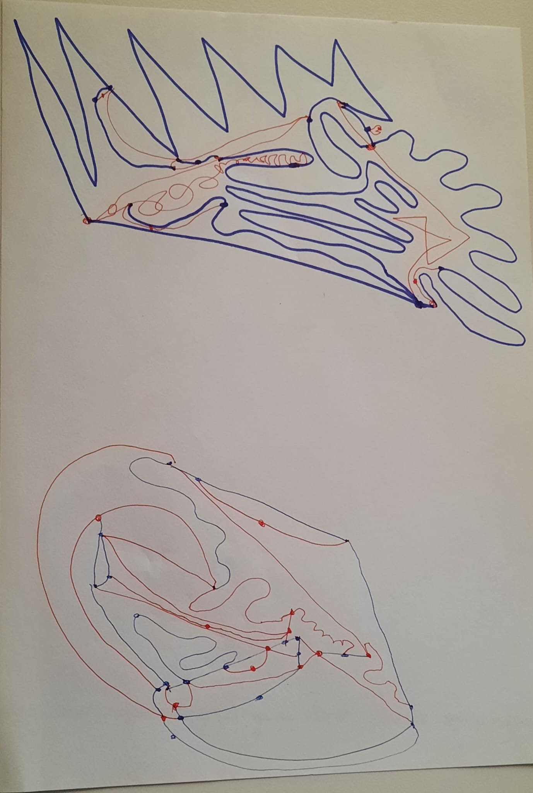

# Week 01
Today, we got to start this new course with lots of inputs and a fun exercise in pairs: the Sprouts Game.

  
  
<i>Our first exercise: The Sprouts Game from Lecture 01.</i>

Currently, I am still struggling with the set up in github. But, I am curious, where this journey will lead us to.