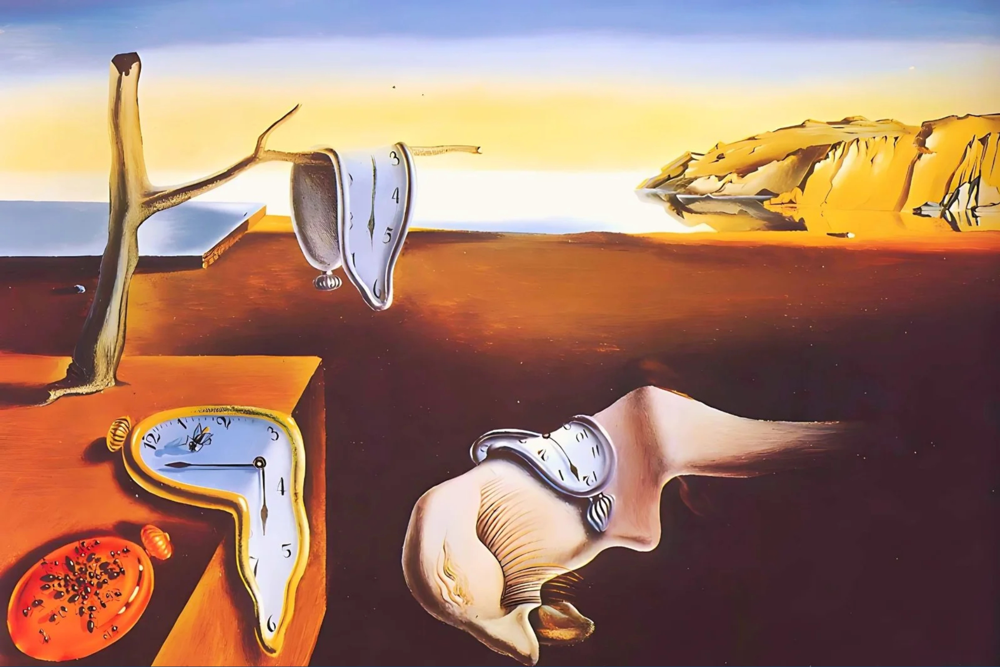
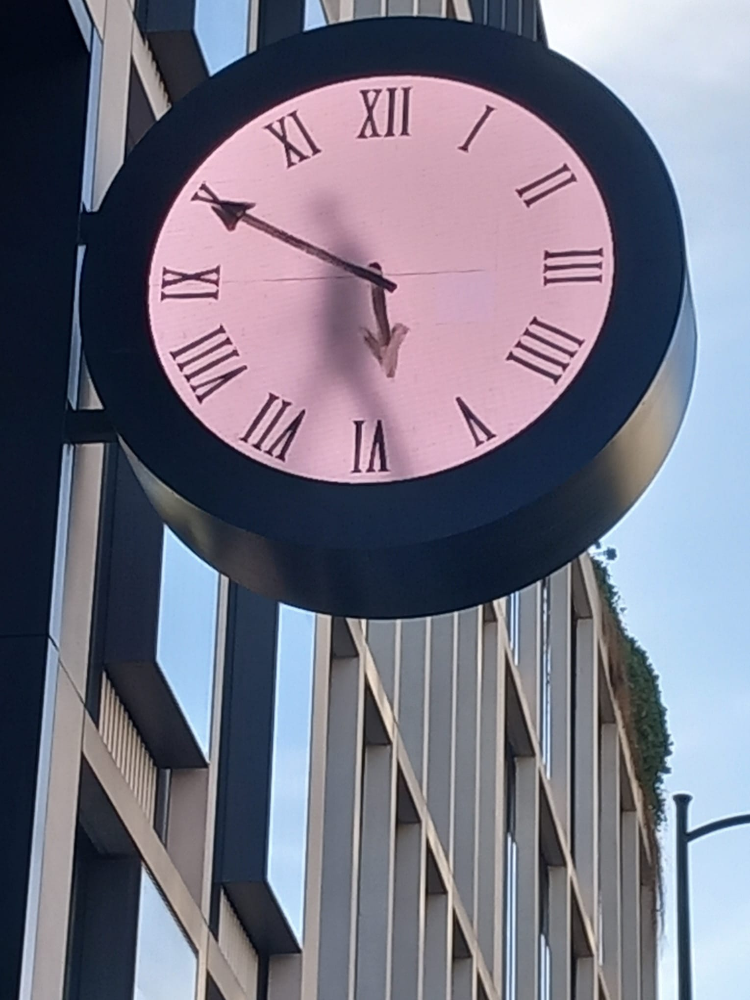
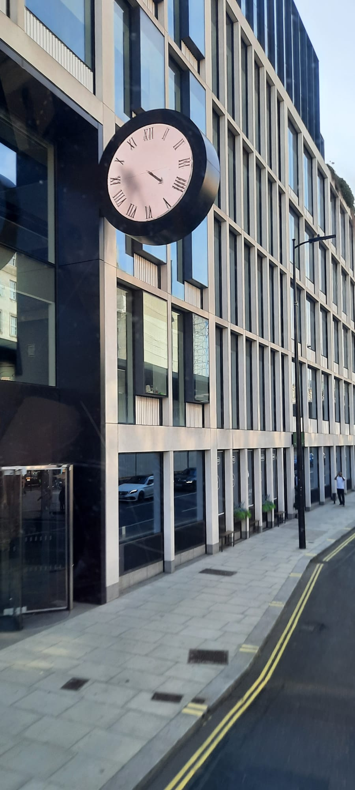
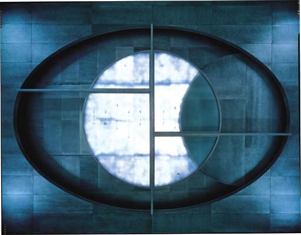
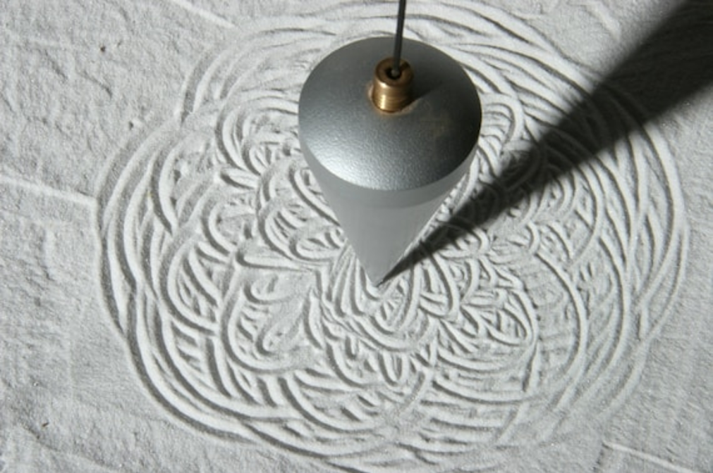
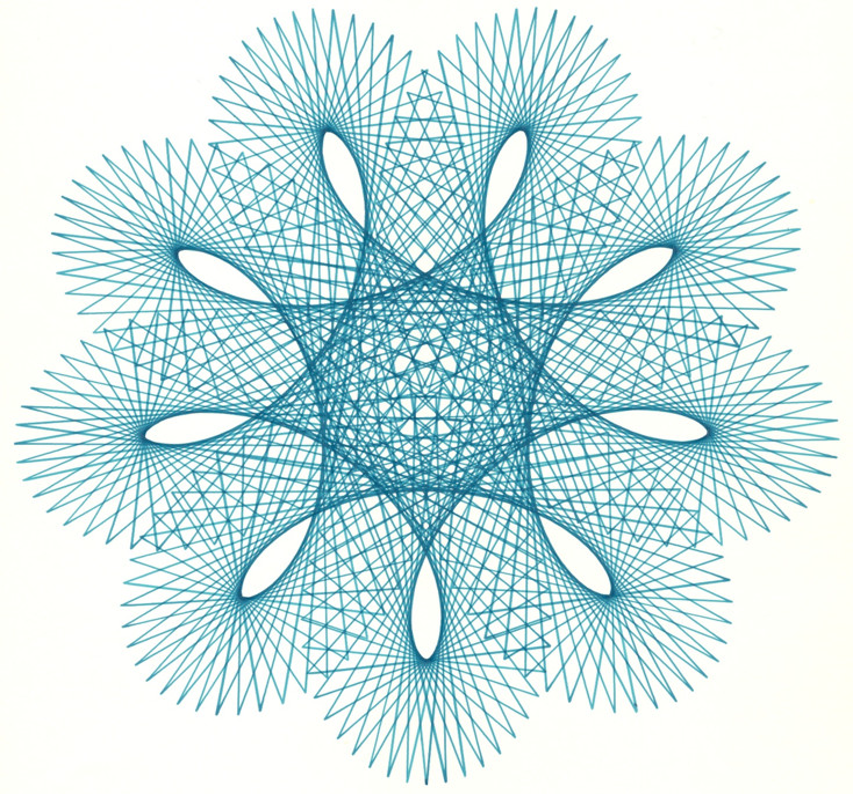
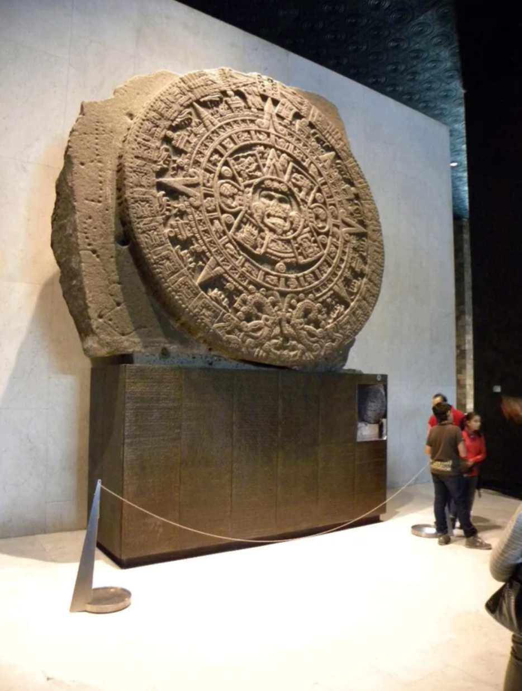

# Week 04 
This week, we yet again look at "time" as a topic. The first artworks that come to my mind are - of course - by Salvador Dalí with his melting clocks...:

  
  
<i>Salvador Dalí - The Persistence of Memory (Melting Clocks).</i>

https://www.framedcanvasart.com/wp-content/uploads/2024/12/The-Persistence-of-Memory-Melting-Clocks-Painting-Salvador-Dali.jpg 

... and a video installation I have spotted right next to the Paddington Station in London. It shows a man painting, erasing and repainting the minute hand on a regular train station's clock. A quick online search told me, that said installation is by Maarten Baas and part of the series "Real Time Clock".

  
  
<i>a close-up photo I took during my last trip to London.</i>

  
  
<i>another photo I took during my last visit to Paddington Station.</i>



  <iframe 
    width="100%" 
    height="450" 
    src="https://www.youtube.com/embed/TigeOpy5-TA" 
    title="YouTube video player" 
    frameborder="0" 
    allow="accelerometer; autoplay; clipboard-write; encrypted-media; gyroscope; picture-in-picture; web-share" 
    allowfullscreen>
  </iframe>
  
<i>Marten Baas - Real Time Clock (Paddington Station installation)</i>


https://www.youtube.com/watch?v=TigeOpy5-TA 

I, then went online again to research art pieces about time and its passage. During this brief search, I discovered an installation by Maya Lin, titled "Eclipsed Time". Exhibited in New York, a disk installed in the ceiling causes an eclipse in intervals, demonstrating the passage of time.

  
  
<i>Maya Lin - Eclipsed Time.</i>

https://uploads5.wikiart.org/00109/images/maya-lin/eclipsed-time-1989-95.jpg 

For my project, I would like to incorporate lunar cycles as a representation of time, ideally combine it with some sort of pendulum, like an old grandfather clock.

  
  
<i>a pendulum: drawing machine and artwork created over time.</i>

(https://www.etsy.com/de/listing/638336792/pendel-auf-sand-meditatives-pendel)

  
  
<i>a piece of spirograph artwork I found during my research.</i>

(https://www.linkedin.com/pulse/design-magic-spirograph-ron-gagnier)

Another object to draw inspiration from would be sun dials, from those one may find in a garden to the ancient ones created by indigenous tribes such as the Aztecs. Actually, my grandfather had brought a heavy one made of a turquoise type of stone from his travels to Mexico. It always held a fascination for me. Unfortunately, it perished when his apartment was cleaned out.

  
  
<i>The Aztec Sun Stone displayed at the National Anthropology Museum in Mexico City.</i>

https://www.reddit.com/media?url=https%3A%2F%2Fpreview.redd.it%2Fd9t0yjd55hg61.jpg%3Fwidth%3D640%26crop%3Dsmart%26auto%3Dwebp%26s%3Df860bf3b48f0d15dc8cce429ae663d03cbc92846

On the side of generative art, I found some stunning pieces. Like:



  <iframe 
    width="100%" 
    height="450" 
    src="https://www.youtube.com/embed/TgbKxXBOUC8" 
    title="Flowers and People - Dark by teamLab" 
    frameborder="0" 
    allow="accelerometer; autoplay; clipboard-write; encrypted-media; gyroscope; picture-in-picture; web-share" 
    allowfullscreen>
  </iframe>
  
<i>teamLab - Flowers and People - Dark βVer.</i>


(https://www.youtube.com/watch?v=TgbKxXBOUC8&list=TLGGjIvR6gz3QvkyODEyMjAyNQ&t=4s)

"Flowers and People - Dark βVersion" by teamLab displays a constant cycle of birth and decay: an algorithm generates flowers in realtime, it is not a pre-recorded video. It is an interactive installation, which reacts to the proximity and movement of spectators. If someone stands still, the flowers bloom and grow. But, as soon as they move, the flowers start to wither. This piece combines a representation of time with direct interaction.



  <iframe 
    width="100%" 
    height="450" 
    src="https://www.youtube.com/embed/FgPpmaImuEs" 
    title="Making time for Christian Marclay's 'The Clock'" 
    frameborder="0" 
    allow="accelerometer; autoplay; clipboard-write; encrypted-media; gyroscope; picture-in-picture; web-share" 
    allowfullscreen>
  </iframe>
  
<i>Christian Marclay - The Clock (CBS Sunday Morning Report)</i>


(https://www.youtube.com/watch?v=FgPpmaImuEs)

"The Clock" by Christian Marclay is a traveling video experience. It is a 24-hour supercut of various clips and excerpts of films, each dealing or displaying "time" and edited to match activites fitting to the time shown. The time shown in the various clip is synced to the local timezone. Should you enter the experience at 06:30 AM local time for example, you'll see Meryl Streep's character Miranda Priestly from "The Devil Wears Prada" switch off her alarm clock, which is set for 06:30 AM.



  <iframe 
    width="100%" 
    height="450" 
    src="https://www.youtube.com/embed/jwOBEZOfWdE" 
    title="Mandelbox World by San Base" 
    frameborder="0" 
    allow="accelerometer; autoplay; clipboard-write; encrypted-media; gyroscope; picture-in-picture; web-share" 
    allowfullscreen>
  </iframe>
  
<i>San Base - Mandelbox World (Fractal Generative Art)</i>


(https://www.youtube.com/watch?v=jwOBEZOfWdE)

The last example I wish to point out is this piece by San Base. This artist works with contiously evolving algorithms, making their works ever changing. Be it a landscape such as "Fractal Trees" or something more abstract like the mechanical-looking "Mandelbox World". Each artwork is generated over time and spectators never see the same piece twice (except one watches a recording).

I also encountered so-called "Peril-Noise Fields", some works of which reminding me of bits of cloth in liquid. While I found the mentioned examples astonishing, especially the various pieces by San Base, they seemed too advanced and too far away from my core idea to attempt to try. Also, it would probably end up in a replica of this existing artwork rather than my own interpretation.