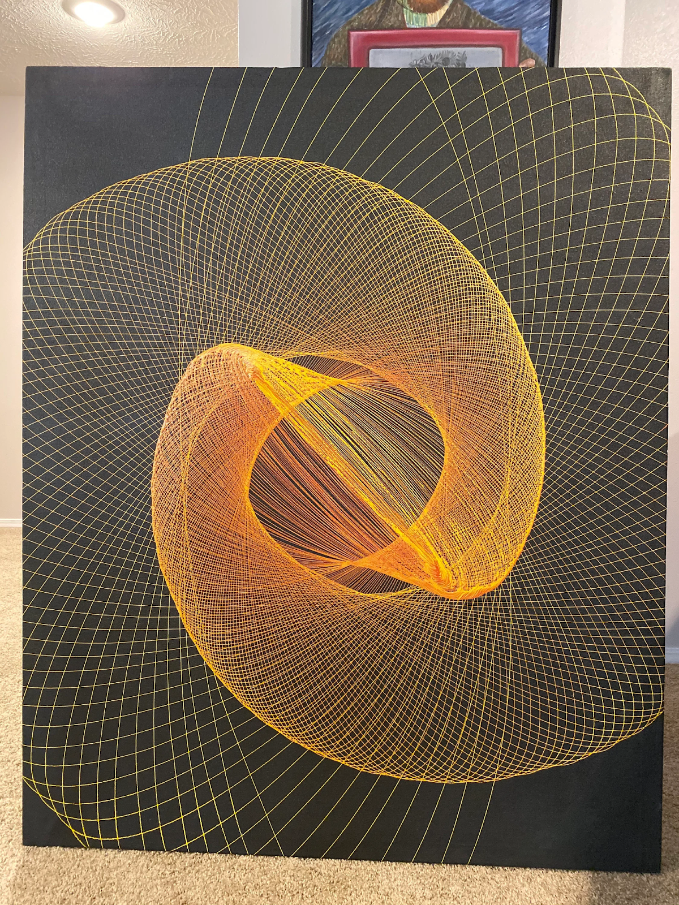
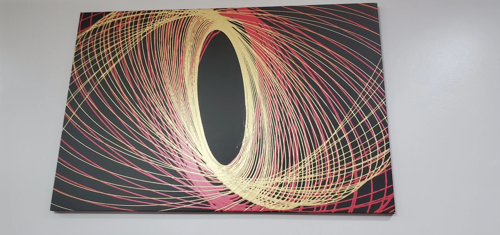

# Week 05 
In today's lecture, we had a look at automated drawing machines. My immediate train of thought went to paint can artwork, in which a container filled with paint is hung on a rope and released onto a canvas. The released paint creates a seemingly infinte path as the container swings like a pendulum or a spirograph. 

  
  
<i>a spirograph painting I found on Reddit while researching.</i>

(https://lh3.googleusercontent.com/Mv6LgdJedWVizMWZUveLO1pEjBydQ9Njk5KiQf8FivjlnNoDJgQfJC5fdn5GgjC70Tyjk-LxamS3lMCJZYoMBckQssOtukIQDVs8xpLXzSWwC37grEhPQJAMsY5Dj-H9kIMuvgnCHPc0nXu2yfY8Sg_NVpNnbF3KVxqVH6M6PUjrdaG0TgoOycYAew) 

  
  
<i>a spirograph painting I found on Etsy while researching.</i>

(https://i.etsystatic.com/24858016/r/il/86d371/2602609981/il_1588xN.2602609981_r9wp.jpg) 

I took this idea into p5.js and programmed a pendulum/drawing machine there, which creates a flower-like pattern in tones of blue and purple.


<iframe src="https://editor.p5js.org/KayWa7/full/knUcwVDIa" width="800" height="800" frameborder="no"></iframe>


The code I used looks as follows: 
let t = 0;                 // time variable for pendulum motion
let rotation = 0;          // overall rotation angle of the figure-eight
let hueShift = 200;        // color hue (blue start)
let cycleCount = 0;
let lastSign = 1;
let centerX, centerY;

function setup() {
  createCanvas(800, 800);
  colorMode(HSB, 360, 100, 100);
  background(0);
  noFill();
  strokeWeight(2);
  centerX = width / 2;
  centerY = height / 2;
}

function draw() {
  // Parameters
  let swingSpeed = TWO_PI / 2;   // 2 seconds per full figure-8 loop
  let rotateSpeed = radians(0.7); // slow rotation per frame
  let xAmp = 250;
  let yAmp = 150;

  // Calculate figure-eight path
  let x = sin(t) * xAmp;
  let y = sin(t * 2) * yAmp / 2;

  // Apply slow rotation to entire pendulum system
  let rx = x * cos(rotation) - y * sin(rotation);
  let ry = x * sin(rotation) + y * cos(rotation);
  let drawX = centerX + rx;
  let drawY = centerY + ry;

  // Draw trail line (connect previous and current positions)
  stroke(hueShift, 100, 100, 0.8);
  point(drawX, drawY);

  // Color change per full loop
  let sign = sin(t) > 0 ? 1 : -1;
  if (sign !== lastSign) {
    cycleCount++;
    if (cycleCount % 2 === 0) {
      hueShift += 10;
      if (hueShift > 300) hueShift = 200; // cycle blue→purple
    }
    lastSign = sign;
  }

  // Advance motion and rotation
  t += swingSpeed / 60;
  rotation += rotateSpeed;
}

This mandala shape is created one second at a time, with the swings of the pendulum timed to last one second each.
After the difficulties I have faced in Visual Studio Code while trying to add images and files to this journal, I am glad to have found a way to combine some of themes and tasks of the past weeks.

I wished to fill the canvas some more and tried to find a simple way to add more depth to the design, so I added a second pendulum behind the first. The second pendulum is larger and changes color randomly every second, making that change with every swing. Here is a snippet of the new bits of code:

// Calculation for the second (larger) pendulum
let t2 = t; 
let rotation2 = rotation * 0.8;

let x2 = sin(t2) * xAmp2;
let y2 = sin(t2 * 2) * yAmp2 / 2;

let rx2 = x2 * cos(rotation2) - y2 * sin(rotation2);
let ry2 = x2 * sin(rotation2) + y2 * cos(rotation2);
let drawX2 = centerX + rx2;
let drawY2 = centerY + ry2;

// Random color change every 1000ms
if (millis() - lastColorChange > 1000) {
  hue2 = random(360);
  lastColorChange = millis();
}

strokeWeight(4); // Thicker trail
stroke(hue2, 100, 100, 0.4); // More transparent
point(drawX2, drawY2);


<iframe src="https://editor.p5js.org/KayWa7/full/M7HkOkjYh" width="100%" height="450" frameborder="no"></iframe>


A next step could be to add controls for users to change the velocity in which the pendulum circles.