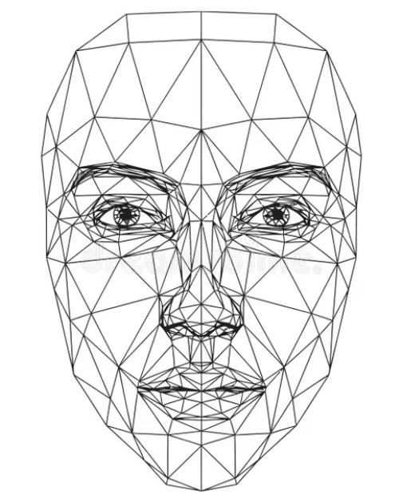

# Week 07 
With today's topic of faces, I commited myself to programming instead of designing something. I simply aimed for replicating this inspirational image:

  
  
<i>an inspiration for a wireframe face.</i>

https://www.dreamstime.com/vector-art-wireframe-depiction-human-face-representing-d-modeling-facial-recognition-technology-digital-identity-image405942177

My first attempt with the help of AI created a grid but not a face. What I liked about it was that the grid moves along with the mouse. That way, should I be able to model a face through code, spectators could get a good look from all angles.


<iframe src="https://editor.p5js.org/KayWa7/full/_IRNlUl9n" width="100%" height="450" frameborder="no"></iframe>


let cols = 30; // Number of columns in the grid
let rows = 30; // Number of rows in the grid
let points = []; // Array to store all grid points

let angleX = 0; // For subtle auto-rotation if desired
let angleY = 0;

let noiseStrength = 0.005; // How much the noise influences point positions
let noiseScale = 0.05;    // How "zoomed in" the noise is

function setup() {
  createCanvas(800, 600, WEBGL); // Use WEBGL for 3D rendering
  
  // No need for explicit noiseSeed here, as Perlin noise will generate variation over time.
  // If you want a fixed starting configuration, you could set one.
  
  // Generate a base grid of points, resembling a curved surface
  // We'll arrange points in rows and columns
  for (let i = 0; i < rows; i++) {
    let row = [];
    for (let j = 0; j < cols; j++) {
      // Calculate initial position based on a spherical or elliptical shape
      // This creates a base "face" like curvature
      let x = map(j, 0, cols - 1, -200, 200);
      let y = map(i, 0, rows - 1, -250, 250); // Make it slightly taller
      
      // A simple elliptical/spherical function to give it depth
      // Adjust these values to get a more face-like initial curve
      let z = sin(map(j, 0, cols - 1, 0, PI)) * cos(map(i, 0, rows - 1, -PI/2, PI/2)) * 150;
      
      // Adjust Z for a more prominent "forehead" and "chin"
      if (i < rows * 0.2) z *= 1.2; // Push forehead out a bit
      if (i > rows * 0.8) z *= 0.8; // Pull chin back a bit

      row.push(createVector(x, y, z));
    }
    points.push(row);
  }
}

function draw() {
  background(20); // Dark background
  
  // Optional: Subtle automatic rotation for better 3D perception
  // rotateX(angleX);
  // rotateY(angleY);
  // angleX += 0.0005;
  // angleY += 0.0007;

  // Manual mouse control for rotation
  rotateY(map(mouseX, 0, width, -PI, PI));
  rotateX(map(mouseY, 0, height, PI/2, -PI/2));

  stroke(0, 200, 255, 180); // Cyan/blueish glow for lines
  strokeWeight(1);
  noFill();

  // Offset for noise function to make it "shift" over time
  let timeOffset = frameCount * noiseStrength;

  // Iterate through the grid to deform points and draw connections
  for (let i = 0; i < rows; i++) {
    beginShape(POINTS); // We will draw individual points later
    for (let j = 0; j < cols; j++) {
      let p = points[i][j];

      // Use Perlin noise to deform the base coordinates
      // The noise "moves" each point independently but smoothly
      let noiseValX = noise(p.x * noiseScale + timeOffset, p.y * noiseScale);
      let noiseValY = noise(p.x * noiseScale, p.y * noiseScale + timeOffset);
      let noiseValZ = noise(p.x * noiseScale + timeOffset * 0.5, p.y * noiseScale + timeOffset * 0.5, timeOffset * 0.5);

      // Map noise values to a deformation range
      let deformX = map(noiseValX, 0, 1, -20, 20);
      let deformY = map(noiseValY, 0, 1, -20, 20);
      let deformZ = map(noiseValZ, 0, 1, -30, 30); // Z deformation has more impact

      // Apply deformation to the base point
      let deformedX = p.x + deformX;
      let deformedY = p.y + deformY;
      let deformedZ = p.z + deformZ;

      // Draw connections for the grid
      if (j < cols - 1) { // Connect horizontally
        let nextP = points[i][j+1];
        let nextNoiseValX = noise(nextP.x * noiseScale + timeOffset, nextP.y * noiseScale);
        let nextNoiseValY = noise(nextP.x * noiseScale, nextP.y * noiseScale + timeOffset);
        let nextNoiseValZ = noise(nextP.x * noiseScale + timeOffset * 0.5, nextP.y * noiseScale + timeOffset * 0.5, timeOffset * 0.5);
        
        let nextDeformedX = nextP.x + map(nextNoiseValX, 0, 1, -20, 20);
        let nextDeformedY = nextP.y + map(nextNoiseValY, 0, 1, -20, 20);
        let nextDeformedZ = nextP.z + map(nextNoiseValZ, 0, 1, -30, 30);
        
        line(deformedX, deformedY, deformedZ, nextDeformedX, nextDeformedY, nextDeformedZ);
      }
      if (i < rows - 1) { // Connect vertically
        let downP = points[i+1][j];
        let downNoiseValX = noise(downP.x * noiseScale + timeOffset, downP.y * noiseScale);
        let downNoiseValY = noise(downP.x * noiseScale, downP.y * noiseScale + timeOffset);
        let downNoiseValZ = noise(downP.x * noiseScale + timeOffset * 0.5, downP.y * noiseScale + timeOffset * 0.5, timeOffset * 0.5);

        let downDeformedX = downP.x + map(downNoiseValX, 0, 1, -20, 20);
        let downDeformedY = downP.y + map(downNoiseValY, 0, 1, -20, 20);
        let downDeformedZ = downP.z + map(downNoiseValZ, 0, 1, -30, 30);

        line(deformedX, deformedY, deformedZ, downDeformedX, downDeformedY, downDeformedZ);
      }
      
      // Draw the DOT at the deformed position (optional, could be removed for pure lines)
      // To draw dots, we need to end the current shape and start a new one for POINTS
      push();
      stroke(0, 255, 255); // Brighter dots
      strokeWeight(2); // Thicker dots
      point(deformedX, deformedY, deformedZ);
      pop();
    }
  }
}

// Function to reset the base mesh or noise if needed
function mousePressed() {
  // Can add a feature here to generate a completely new "base" shape if desired
  // For now, the noise will continuously shift it.
}

Next, I tried to have an actual face, but the way it turned out reminded me more of Pinocchio rather than a real human face. I definitely need to make changes to come near the image I looked up.


<iframe src="https://editor.p5js.org/KayWa7/full/loZMh5ZER" width="100%" height="450" frameborder="no"></iframe>


let cols = 30; // Number of columns in the grid
let rows = 30; // Number of rows in the grid
let points = []; // Array to store all grid points

let angleX = 0; 
let angleY = 0;

let noiseStrength = 0.005; 
let noiseScale = 0.05;    

function setup() {
  createCanvas(800, 600, WEBGL); 
  
  // Base constants for facial features (normalized to grid indices)
  const noseColStart = round(cols * 0.45);
  const noseColEnd = round(cols * 0.55);
  const noseRow = round(rows * 0.45);
  const eyeRow = round(rows * 0.3);
  const eyeWidth = round(cols * 0.15);
  
  // Generate the grid points with feature geometry
  for (let i = 0; i < rows; i++) {
    let row = [];
    for (let j = 0; j < cols; j++) {
      // 1. Calculate base position (x, y)
      let x = map(j, 0, cols - 1, -200, 200);
      let y = map(i, 0, rows - 1, -250, 250); 
      
      // 2. Calculate base Z (depth) for general curvature (ellipsoid)
      let z = sin(map(j, 0, cols - 1, 0, PI)) * cos(map(i, 0, rows - 1, -PI/2, PI/2)) * 150;
      
      // --- Feature Logic ---

      // A. Create the NOSE PEAK (Push Z forward)
      if (i > noseRow && i < noseRow + 5) { // Vertical position for the nose area
        if (j >= noseColStart && j <= noseColEnd) { // Central columns
          // Map distance from center to push Z out further (peak effect)
          let nosePeakFactor = 1.0 - abs(j - cols/2) / (cols/2); 
          z += 100 * nosePeakFactor; // Push the Z coordinate significantly forward
        }
      }
      
      // B. Create the EYE SOCKETS (Pull Z backward to create gaps)
      // Check the row for eye height
      if (i >= eyeRow && i < eyeRow + 5) { 
        // Left Eye Socket (adjust j for column range)
        if (j > noseColStart - eyeWidth && j < noseColStart) {
            z -= 60; // Pull Z backward to create a concave socket
        }
        // Right Eye Socket
        if (j > noseColEnd && j < noseColEnd + eyeWidth) {
            z -= 60; // Pull Z backward
        }
      }

      row.push(createVector(x, y, z));
    }
    points.push(row);
  }
}

// ---------------------------------------------------------------- //

// The draw() function remains the same as in the previous response, 
// handling noise deformation, line connections, and 3D rendering.

function draw() {
  background(20); 
  
  rotateY(map(mouseX, 0, width, -PI, PI));
  rotateX(map(mouseY, 0, height, PI/2, -PI/2));

  stroke(0, 200, 255, 180); 
  strokeWeight(1);
  noFill();

  let timeOffset = frameCount * noiseStrength;

  for (let i = 0; i < rows; i++) {
    for (let j = 0; j < cols; j++) {
      let p = points[i][j];

      // Use Perlin noise to deform the base coordinates (Z deformation has more impact)
      let noiseValX = noise(p.x * noiseScale + timeOffset, p.y * noiseScale);
      let noiseValY = noise(p.x * noiseScale, p.y * noiseScale + timeOffset);
      let noiseValZ = noise(p.x * noiseScale + timeOffset * 0.5, p.y * noiseScale + timeOffset * 0.5, timeOffset * 0.5);

      let deformX = map(noiseValX, 0, 1, -20, 20);
      let deformY = map(noiseValY, 0, 1, -20, 20);
      let deformZ = map(noiseValZ, 0, 1, -30, 30); 

      // Apply deformation to the base point
      let deformedX = p.x + deformX;
      let deformedY = p.y + deformY;
      let deformedZ = p.z + deformZ;

      // Draw connections for the grid
      if (j < cols - 1) { // Connect horizontally
        let nextP = points[i][j+1];
        let nextDeformedZ = nextP.z + map(noise(nextP.x * noiseScale + timeOffset * 0.5, nextP.y * noiseScale + timeOffset * 0.5, timeOffset * 0.5), 0, 1, -30, 30);
        let nextDeformedY = nextP.y + map(noise(nextP.x * noiseScale, nextP.y * noiseScale + timeOffset), 0, 1, -20, 20);
        let nextDeformedX = nextP.x + map(noise(nextP.x * noiseScale + timeOffset, nextP.y * noiseScale), 0, 1, -20, 20);
        
        line(deformedX, deformedY, deformedZ, nextDeformedX, nextDeformedY, nextDeformedZ);
      }
      if (i < rows - 1) { // Connect vertically
        let downP = points[i+1][j];
        let downDeformedZ = downP.z + map(noise(downP.x * noiseScale + timeOffset * 0.5, downP.y * noiseScale + timeOffset * 0.5, timeOffset * 0.5), 0, 1, -30, 30);
        let downDeformedY = downP.y + map(noise(downP.x * noiseScale, downP.y * noiseScale + timeOffset), 0, 1, -20, 20);
        let downDeformedX = downP.x + map(noise(downP.x * noiseScale + timeOffset, downP.y * noiseScale), 0, 1, -20, 20);
        
        line(deformedX, deformedY, deformedZ, downDeformedX, downDeformedY, downDeformedZ);
      }
      
      // Draw the DOT at the deformed position
      push();
      stroke(0, 255, 255); 
      strokeWeight(2); 
      point(deformedX, deformedY, deformedZ);
      pop();
    }
  }
}

On the organisational side, I figured out how to add the P5.js files into this journal, which I am glad about and it fuels my motivation. At least now, I am able to demonstrate in a more direct way what I am experiement with and working on.
