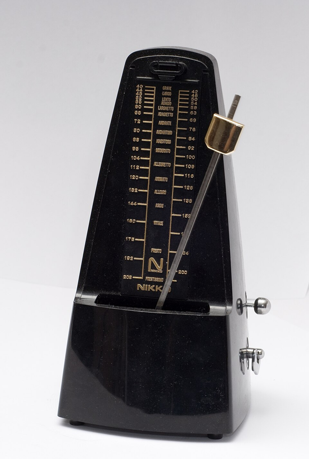
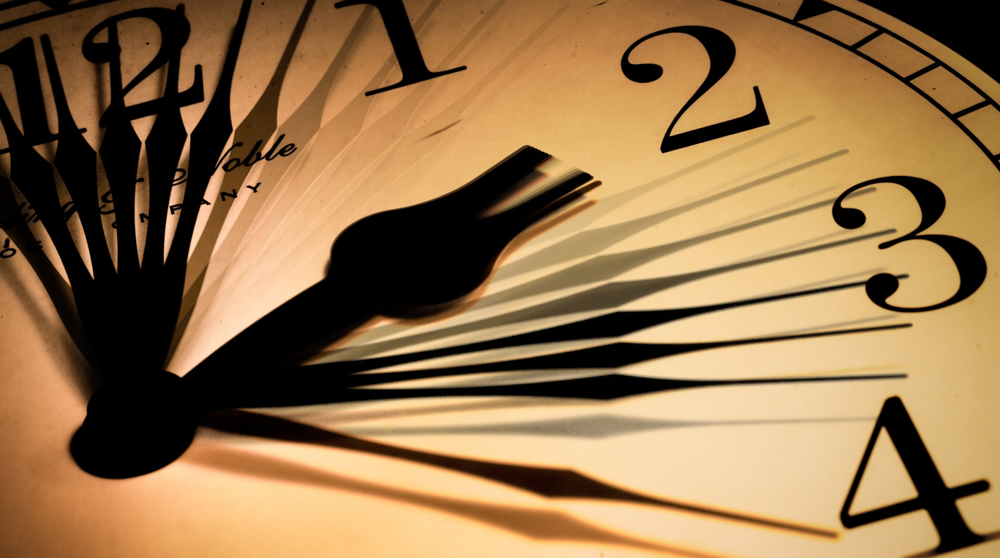

# Week 13
With the presentation coming up next week, I shall dedicate the remaining time on refining my current sketch. 
My project focuses on the topic "time" and the passing of which. The base colors and motives are inspired by the moon and stars: crescent and pentagram shapes in white, black and shades of blue. Those shapes are rotating in a circle, like a clock-wise dial. Inside, there is a spirograph drawing a mandala inside the circle. Each swing lasts a second and the line changes the color, like a visual metronome. 

  
  
<i>metronome = accoustic indicator of time.</i>

(https://en.wiktionary.org/wiki/metronome#/media/File:Metronome_Nikko.jpg)

Combining those occult elements made the canvas look like a sigil. For interactivity, I currently have three functions planned: 

- the stopping of time: hover on the left side of the canvas
- moving with time: hover in the middle of the canvas
- the rushing of time: hover on the right side of the canvas

Ultimately, the message I try to convey is, how different time can feel. It can pass by in a flash, or it can feel as if it stopped altogether. But no matter how hard you try, one cannot stop time.

  
  
<i>an inspirational image for the perception of "TIME".</i>

(https://www.scientificamerican.com/article/why-does-time-seem-to-speed-up-with-age/)

I removed the "click to change color" function because it was merely an experiment and did not really fit into my concept idea.
So, I took a step towards the end project by removing the clicking and have the color change after a second instead.

// Palette: Starts with white, then various shades of blue (RGB)
let spiroColorPalette = [
    [255, 255, 255],  // 1. White
    [173, 216, 230],  // 2. Light Blue
    [0, 191, 255],    // 3. Deep Sky Blue
    [30, 144, 255],   // 4. Dodger Blue
    [0, 0, 255],      // 5. Pure Blue
    [0, 0, 128]       // 6. Navy Blue
];
let spiroColorIndex = 0;
// Time tracking for 1-second interval
let lastColorChange = 0;

function setup() {
    // ... other setup code ...
    // Set the initial color change time to start the cycle immediately
    lastColorChange = millis();
}

// --- Color Change Logic (NEW) ---
// Check if 1000 milliseconds (1 second) has passed since the last change
if (millis() > lastColorChange + 1000) {
    // Cycle to the next color in the palette
    spiroColorIndex = (spiroColorIndex + 1) % spiroColorPalette.length;
    // Reset the timer
    lastColorChange = millis();
}


<iframe src="https://editor.p5js.org/KayWa7/full/nOf2DDTSl" width="100%" height="450" frameborder="no"></iframe>


Next, I tried to sync the color change with the swings of the spirograph. Each swing must last one second. This endeavor ended however in this odd behavior:


<iframe src="https://editor.p5js.org/KayWa7/full/kZVAfPpA8" width="100%" height="450" frameborder="no"></iframe>


This attempt has an interesting side effect: the starting point of that swinging spirograph changes everytime. It makes me think of the hand indicating the seconds on a clock. Somehow, somewhere with introducing the new timing constant and a path clearing function I wrecked the working pendulum. When trying to explore this further - with the aid of Google Gemini to identify the cause - the alterations had another undesired effect:


<iframe src="https://editor.p5js.org/KayWa7/full/7qbt7dk9r" width="100%" height="450" frameborder="no"></iframe>


The spirograph was back, albeit in a random and messy form. While this had a strange appeal as well, it went against my vision of a relaxing pendulum-esque spirograph. For another artwork and in more dimmed colors, this might be an interesting background.
I still was interested in exploring the idea of having a wavy hand on a clock, so I tried again.


<iframe src="https://editor.p5js.org/KayWa7/full/IayocSq77" width="100%" height="450" frameborder="no"></iframe>


This was only slightly closer to what I intended to create. The color change was there, as was the shift in angle. But it still was not the continous spirograph I wanted.
To include and embed the seconds clock hand, I added a band to separate the rotating moon and stars and moved the spirograph into the background.


<iframe src="https://editor.p5js.org/KayWa7/full/hIgX81VLp" width="100%" height="450" frameborder="no"></iframe>


The longer I let the spirograph draw in the background I realized that this too works as an indicator of time, and should anyone have the patiences to let it runs for a ridiculous amount of time, the backdrop would be filled with fine lines.
So, this accident made for a nice additional touch.